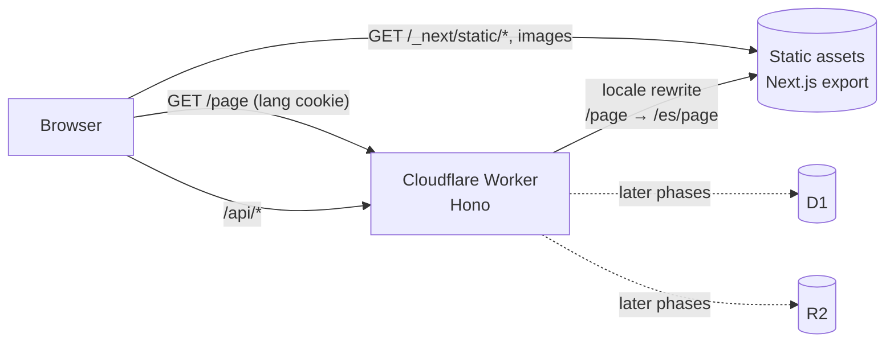

# Mundo Motos

[](https://github.com/gaf-digital-mx/mundoMotos/actions/workflows/ci.yml)
[](https://github.com/gaf-digital-mx/mundoMotos/actions/workflows/security.yml)
[](https://scorecard.dev/viewer/?uri=github.com/gaf-digital-mx/mundoMotos)
[](LICENSE)

Website for **Mundo Motos**, a motorcycle parts store and repair shop in Mexico. It is a lead-generation site: it
doesn't sell online. It turns local searches into WhatsApp conversations and store visits, and it adds a gamified
challenges area that rewards visitors with QR coupons they redeem at the counter.

Built to run on **$0/month infrastructure** (the domain is the only cost), with production-grade engineering practices.

## Architecture



- **One Cloudflare Worker** serves the Next.js static export as assets and a Hono API under `/api/*`. Front end and
  API deploy atomically, share one origin (no CORS) and fit the Workers Free plan.
- **Static by default.** Pages are pre-rendered at build time. Fingerprinted assets never invoke the Worker script.
- **No locale in URLs.** The site is built once per locale. The Worker picks the tree from a `lang` cookie
  (Spanish by default), so URLs stay clean (`/catalogo`, never `/es/catalogo`).
- **Modular monolith with clean architecture where business rules live** (coupons, challenges): domain → use
  cases with ports → adapters. CRUD modules stay thin. **dependency-cruiser enforces the layer rules in CI.**
- **Shared contracts:** Zod schemas in `packages/contracts` are the only coupling between the web app and the API.

## Tech stack

| Area       | Tools                                                                                                                              |
| ---------- | ---------------------------------------------------------------------------------------------------------------------------------- |
| Web        | Next.js 16 (App Router, static export), React 19, Tailwind CSS v4, next-intl                                                       |
| API / edge | Cloudflare Workers, Hono, Wrangler                                                                                                 |
| Language   | TypeScript (strict, `noUncheckedIndexedAccess`, `exactOptionalPropertyTypes`), Zod                                                 |
| Monorepo   | pnpm workspaces, Turborepo                                                                                                         |
| Quality    | ESLint (typescript-eslint strict, jsx-a11y, i18n literal-string check), Prettier, dependency-cruiser, Lefthook, commitlint         |
| Tests      | Vitest, `@cloudflare/vitest-pool-workers` (integration tests inside workerd), Testing Library, Playwright, axe-core, Lighthouse CI |
| CI/CD      | GitHub Actions (SHA-pinned), preview deploys per PR, staging on `main`, production on release (release-please), automatic rollback |
| Security   | CodeQL, TruffleHog secret scanning, dependency review, Dependabot, OpenSSF Scorecard                                               |

## Getting started

Requirements: Node.js 24 (`.nvmrc`) and pnpm through Corepack.

```bash
corepack enable
pnpm install
cp apps/web/.env.example apps/web/.env.local && cp apps/api/.dev.vars.example apps/api/.dev.vars
pnpm build && pnpm --filter @mundomotos/api dev   # http://localhost:8787
```

`pnpm --filter @mundomotos/web dev` runs the Next.js dev server with hot reload (no Worker rewrite).

## Scripts

| Command                            | What it does                                               |
| ---------------------------------- | ---------------------------------------------------------- |
| `pnpm build`                       | Static export (`apps/web/out`) + Worker bundle dry run     |
| `pnpm lint` / `pnpm lint:deps`     | ESLint / architecture rules                                |
| `pnpm typecheck`                   | TypeScript across the monorepo                             |
| `pnpm test` / `pnpm test:coverage` | Unit and component tests (coverage thresholds enforced)    |
| `pnpm test:integration`            | API tests inside the Workers runtime                       |
| `pnpm test:e2e`                    | Playwright + axe against the real Worker serving the build |
| `pnpm check:budgets`               | Worker size and landing-page JS budgets                    |

## Project structure

```text
apps/
  web/            Next.js static export: routes in src/app, feature modules in src/features
  api/            Cloudflare Worker: Hono API, locale-aware static serving, modules by capability
packages/
  contracts/      Zod schemas + types shared by web and API
  eslint-config/  Shared flat configs (base, next, worker)
  tsconfig/       Shared TypeScript presets
```

## Configuration

Site identity and business contact data (`SITE_URL`, `SITE_INDEXABLE`, `BUSINESS_WHATSAPP_NUMBER`,
`BUSINESS_PHONE_NUMBER`, `BUSINESS_FACEBOOK_URL`) are **GitHub Environment variables**. The deploy workflow injects
them into both the static build and the Worker, and both validate them with Zod. Changing the WhatsApp number means
editing one variable and re-running the deploy, with no code change.

## Contributing

See [CONTRIBUTING.md](CONTRIBUTING.md). Commits follow [Conventional Commits](https://www.conventionalcommits.org/).

## License

Code under the [MIT License](LICENSE). Brand assets in `apps/web/public/brand/` are © Mundo Motos, all rights
reserved ([details](apps/web/public/brand/LICENSE)).
